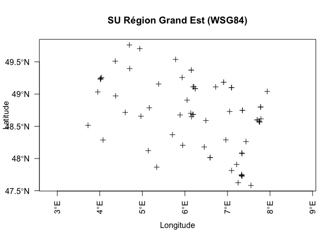
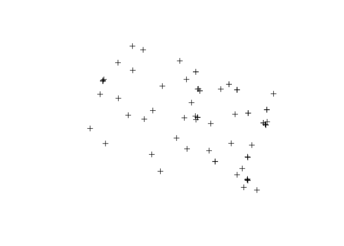
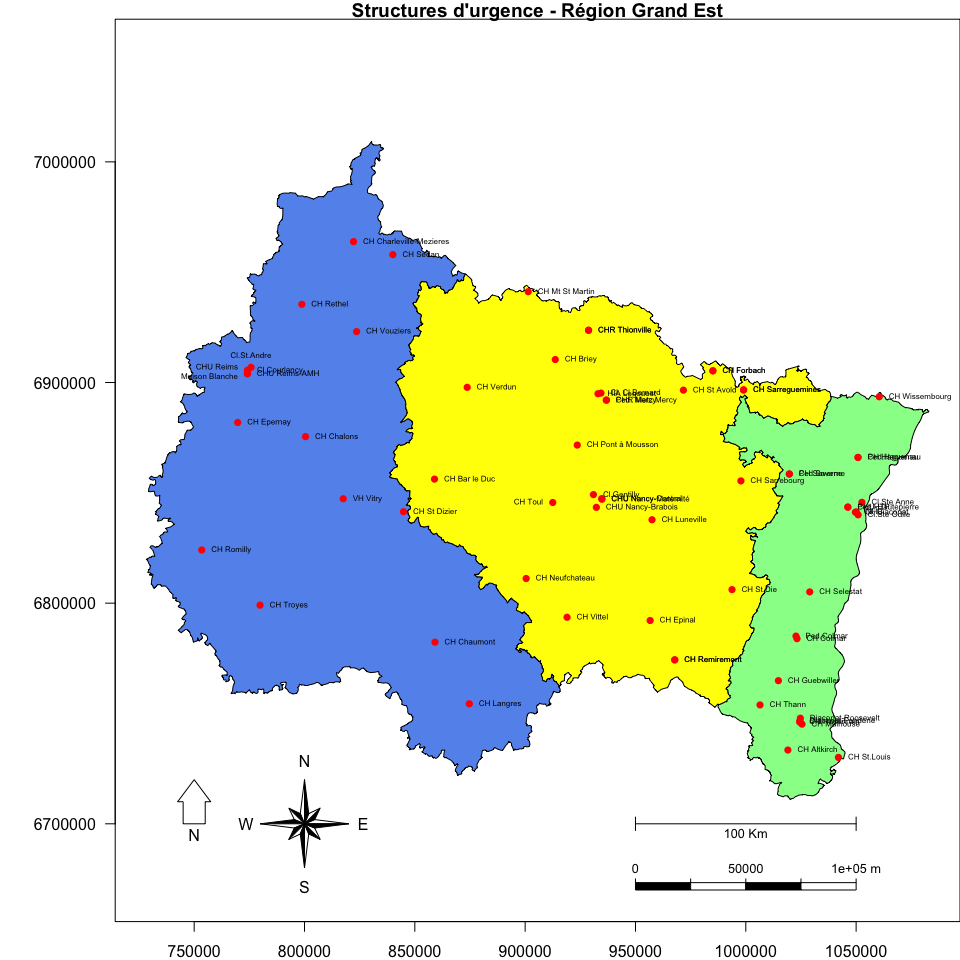

# Préparation des données de cartographie
jcb  
5 mai 2016  

__Source: MacBook::Documents/R/Rcarto/Alca2015/Hop_Alca/data_prepare.Rmd__

L'objectif est de rassembler et de préparer les données nécessaires pour dessiner une carte de la région Grand Est (RGE) avec:

- les limites des anciennes régions
- la géolocalisation des établissements de santé (ES) ayant une autorisation de setructure d'urgence (SU). 

Le fond de carte est fourni par les données open data de l'IGN. Les fichiers sont au format _shapefile_. Les coordonnées des points sont en _Lambert93_.

Les coordonnées des ES sont fournies par un fichier Excel récupéré auprès de la FEDORU. Il s'agit de coordonnées approximatives correspondant à l'adresse postale de l'établissement. _R_ permet de récupérer ce type d'information à partir de Googlemap. Les coordonnées des ES sont au format WSG84. Il faut les convertir en Lambert93.

Préparation des donnnéess
========================================================

NB: pour réinitialiser la fenêtre graphique: dev.off()

Les données des ES Grand Est sont tockées dans un fichier _Excel_. Une copie de ce fichier ce trouve dans ce dossier: dernière mise à jour le 2/5/2016. Celui-ci comporte autant d'onglets que de région. On enregistre chaque onglet séparément au format text *.csv*: 1 fichier par ES. Les données proviennent du dossier FEDORU [https://docs.google.com/spreadsheets/d/1SZ4HIfJhGRtdX-DKDJexgSpYAokGEimx0WSxYcZE_wA/edit#gid=1762187829](https://docs.google.com/spreadsh
eets/d/1SZ4HIfJhGRtdX-DKDJexgSpYAokGEimx0WSxYcZE_wA/edit#gid=1762187829)

La première ligne est constituée de cellules fusionnées. On élimine la première ligne. La deuxième ligne  est le header. L'ensembles des données sont extraites pour former un fichier *.Rda*. Le dossier ne doit comprter que les fichiers csv correspondant à chacune des régions. Une boucle for incorpore chacun des fichiers pour former un dataframe des ES.

Avant la sauvegarde les noms des colonnes sont simplifiés.


```r
# setwd("/Users/jcb/Documents/R/RCarto/ALCA_2015/Hop_alca")
getwd()
```

```
## [1] "/Users/jcb/Documents/R/RCarto/ALCA_2015/Hop_Alca"
```

```r
path = "./"
out.file <- NA
file.names <- dir(path, pattern =".csv") # seuls les fichiers se terminant par csv sont lus
file.names
```

```
## [1] "Structures d'urgence - Alsace.csv"           
## [2] "Structures d'urgence - Champagne-Ardenne.csv"
## [3] "Structures d'urgence - Lorraine.csv"
```

```r
for(i in 1:length(file.names)){
   file <- read.csv(paste0(path, file.names[i]), skip = 1, encoding = "UTF-8") # 
   out.file <- rbind(out.file, file)
 }

dim(out.file)
```

```
## [1] 68 18
```

```r
# supprimer la ligne 1 qui est vide
out.file <- out.file[-1,]

# Renommer les colonnes
names(out.file) <- c("Date_modif", "Hopital", "Finess","Adresse1", "Adresse2", "CP", "Ville", "Type_SU", "Type_Structure", "Type_etab", "Adresse_Geo","Latitude","Longitude","Adresse_Geocode","Score","Precision", "Departement", "Code_Insee")

write.table(out.file, file = "../su_alca.csv", sep=",", row.names = FALSE, qmethod = "double") # , fileEncoding = "utf-8"

d <- out.file

# transforme la colonne 1 en dates
d$Date_modif <- as.Date(d$Date_modif, "%d/%m/%Y")

save(d, file = "../su_alca.Rda")

names(d)
```

```
##  [1] "Date_modif"      "Hopital"         "Finess"         
##  [4] "Adresse1"        "Adresse2"        "CP"             
##  [7] "Ville"           "Type_SU"         "Type_Structure" 
## [10] "Type_etab"       "Adresse_Geo"     "Latitude"       
## [13] "Longitude"       "Adresse_Geocode" "Score"          
## [16] "Precision"       "Departement"     "Code_Insee"
```

```r
str(d)  
```

```
## 'data.frame':	67 obs. of  18 variables:
##  $ Date_modif     : Date, format: "2016-05-01" "2016-06-01" ...
##  $ Hopital        : Factor w/ 59 levels "CENTRE HOSPITALIER D ALTKIRCH",..: 10 15 12 16 3 3 9 9 8 5 ...
##  $ Finess         : int  670000025 670016237 670780162 670780212 670780337 670780337 670780345 670780345 670780543 670780691 ...
##  $ Adresse1       : Factor w/ 59 levels "","1 - 3 rue saint jacques",..: 4 16 9 6 17 17 7 7 13 11 ...
##  $ Adresse2       : Factor w/ 34 levels "","B.P.  1022",..: 11 1 12 1 8 8 6 6 5 9 ...
##  $ CP             : int  67091 67100 67085 67085 67504 67504 67703 67703 67166 67606 ...
##  $ Ville          : Factor w/ 49 levels "ALTKIRCH CEDEX",..: 10 9 10 10 4 4 6 6 13 7 ...
##  $ Type_SU        : Factor w/ 3 levels "Adulte","Généraliste",..: 1 2 2 2 1 3 1 3 2 2 ...
##  $ Type_Structure : Factor w/ 4 levels "ESPIC","public",..: 2 1 1 1 2 2 2 2 2 2 ...
##  $ Type_etab      : Factor w/ 5 levels "autre","CHU/CHR",..: 2 1 1 1 4 4 4 4 4 4 ...
##  $ Adresse_Geo    : Factor w/ 59 levels "1 - 3 rue saint jacques 68802 THANN",..: 3 16 9 6 17 17 7 7 13 11 ...
##  $ Latitude       : num  48.6 48.6 48.6 48.6 48.8 ...
##  $ Longitude      : num  7.75 7.76 7.74 7.79 7.78 ...
##  $ Adresse_Geocode: Factor w/ 59 levels "","1 Avenue Molière 67200 Strasbourg",..: 3 16 8 5 17 17 6 6 12 10 ...
##  $ Score          : num  0.8 0.94 0.8 0.82 0.73 0.73 0.82 0.82 0.76 0.84 ...
##  $ Precision      : Factor w/ 3 levels "","housenumber",..: 2 2 2 2 2 2 2 2 2 2 ...
##  $ Departement    : Factor w/ 10 levels "67, Bas-Rhin, Alsace",..: 1 1 1 1 1 1 1 1 1 1 ...
##  $ Code_Insee     : int  67482 67482 67482 67482 67180 67180 67437 67437 67544 67462 ...
```
          
Transformation en Spatial_Points
================================

Convertir le data.frame en SpatialPointsDataFrame
-------------------------------------------------
Cete étape et réalisée par la fonction __coordinates__ du package __sp__, en spécifiant les colonnes du data.frame qui contiennent les coordonnées géographiques sous forme d'un objet _formule_ ~x_coord+y_coord. 


```r
library(sp)
d2 <- d
coordinates(d2) = ~ Longitude + Latitude
```

Ajouter les informations CRS
----------------------------
Les information CRS permmettent de savoir dans quel système de cordonnées ont été faites les mesures. Ici il s'agit du systéme WGS84.

```r
proj4string(d2) = CRS("+proj=longlat +datum=WGS84")
```

Résultat

On peut dessiner le dataframe résultant avec la fonction plot. Par défaut les points sont dessinés par une croix.

```r
plot(d2, xlab = "Longitude", ylab = "Latitude", axes = TRUE, las = 2, main = "SU Région Grand Est (WSG84)")
```



Ajout d'un colonne nom simplifié pour les SU: le nom original des SU ne convient pas pour une carte => on les redéfinit: 

```r
n <- c("NHC", "Cl.Ste Odile","Cl. Diaconat","Cl.Ste Anne","CH Haguenau","Ped.Haguenau","CH Saverne","Ped.Saverne","CH Wissembourg","CH Selestat","CHU-Hautepierre","Ped.HTP","CH St.Louis","Diaconat-Fonderie","CH Altkirch","CH Thann","CH Hasenrain","CH Colmar","CH Guebwiller","Ped.Colmar","CH Mulhouse","Diaconat-Roosevelt","CH Sedan","CH Rethel","CH Vouziers","CH Charleville-Mezieres","CH Troyes","CH Romilly","CH Chalons","CH Epernay","VH Vitry","Cl.Courlancy","Cl.St.Andre","CHU Reims-AMH","CHU Reims\n Maison Blanche", "CH Chaumont","CH Langres","CH St Dizier","CHU Nancy-Maternité","CH Toul","CH Luneville","CH Pont à Mousson","Cl.Gentilly","CH Briey","CH Mt St Martin","CHU Nancy-Central","CHU Nancy-Brabois","CH Verdun","CH Bar le Duc","CH Forbach", "CH Forbach","CH Sarrebourg","CH St Avold","CHR Thionville", "CHR Thionville","CHR Metz Mercy", "Ped. Mercy", "HIA Legouest", "Cl. Cl.Bernard","CH Sarreguemines", "CH Sarreguemines","CH Epinal","CH St Die","CH Neufchateau","CH Remiremont","CH Remiremont", "CH Vittel")

d2$SU <- n
```

Enregistrer le résultat sous forme de ShapeFile ESRI
----------------------------------------------------
On utilise la librairie __rgdal__. La fonctiopn __writeOGR__ nécessite les informations suivantes:

- obj: fichier à enregistrer
- dsn: nom du dossier où seront stockées les fichiers shapefile. Si le dossier n'existe pas, il est créé.
- layer: couche = nom générique des différents fichers shp (ex. unv)
- driver: méthode de traduction. Ici ESRI. 
```{}
library(rgdal)
su_alca <- d2
writeOGR(su_alca, "../ShapeFile_SU_Alca", "su_alca", "ESRI Shapefile")
```

Il est possible de lire le ficher SHP créé avec __readOGR__:
```{}
library(rgdal)
su_alca_wsg84 = readOGR("../ShapeFile_SU_Alca", "su_alca", stringsAsFactors = FALSE)
```

Reprojeter au format Lambert 93
===============================

Le dataframe __d2__ contient les coordonnées des SU au format WGS84. On le tansfrme en coordonnées Lambert par la fonction _spTransform__ qui demande le CRS correspondant au format Lambert93.

```r
# EPSG:2154 Lambert 93
newProj = CRS("+proj=lcc +lat_1=49 +lat_2=44 +lat_0=46.5 +lon_0=3 +x_0=700000 +y_0=6600000 +ellps=GRS80 +towgs84=0,0,0,0,0,0,0 +units=m +no_defs")

plot(d2)
```



```r
su_alca_L93 <- spTransform(d2, newProj)
# plot(su_alca_L93, xlab = "Longitude", ylab = "Latitude", axes = TRUE, las = 1, main = "SU Région Grand Est (Lambert 93)")
```

Et créer un shapefile Lambert 93
--------------------------------
La fonction _writeOGR_ plante si le fichier résultant existe déjà. Si on veut relancer la fonction il faut soit effacer le fichier existant soit le renommer. NB: on peut forcer la réécriture avec loption overwrite_layer = TRUE. Cependant cette usage est déconseillé par la version précédente est totalement détruite.

```{}
writeOGR(su_alca_L93, "../ShapeFile_SU_Alca_L93", "su_alca_L93", "ESRI Shapefile")
```

Trouver le bon EPSG/CRS
=======================
Coordinate Reference System ou [CRS](https://www.nceas.ucsb.edu/~frazier/RSpatialGuides/OverviewCoordinateReferenceSystems.pdf) sont gérés en R par les packages _sp_ et _rgdal_. 

En R, la notation utilisée pour décrire un CRS est _proj4string_ de la librairie __PROJ.4__. Cela ressemble à ça:
+init=epsg:4121 +proj = longlat +ellps=GRS80

Un CRS particulier peut être référencé par son code EPSG  (i.e., epsg:4121). 

En R, les details d'un EPSG code peut être récupéré:
```
CRS("+init=epsg:4326")
```
qui retourne:
```
+init=epsg:4326 +proj=longlat+ellps=WGS84 +datum=WGS84 +no_defs+towgs84=0,0,0
```
On peut créer un data frame de tpous les CRSs:
```{r}
EPSG <-make_EPSG()
head(EPSG)
```
qui retourne un data frame avec les columns:

- code: EPSG code
- note: notes as included in the file
- prj4character: PROJ.4 attributes for the projection

On peut chercher un code particulier dans le Data Frame avec la fonction __grep__:
```
EPSG[grep("4269", EPSG$code), ]
```
##EPSG codes for commonly used CRS

### Latitude/Longitude: WGS84 (EPSG: 4326) 
Très utilisé par les organisations fournissant des données GIS. CRS used by Google Earth

### Mercator (EPSG: 3857)
Tiles from Google Maps, Open Street Maps, Stamen Maps

Manipulation des CRS dans R:
---------------------------
### Pour la classe _sp_:
Certains fichiers de données sont fournis avec des indications de projection comme les shapefiles. Si on utilise __readOGR__ pour les importer, cette information est automatiquement transférée dans R.

pour retruver le CRS d'un objet spatial:
```proj4string(x)
```

Pour assigner un CRS à un objet spatial:
```
proj4string(x)  <-CRS("+init=epsg:28992")
```
ou avec les attributs de PROJ.4:
```
proj4string(x) <-CRS("+proj=utm+zone=10 +datum=WGS84")
```

Pour ransformer un CRS dans un autre:
```
newData <- spTransform(x, CRS("+init=epsg:4238"))
```
ou, reference the CRS d'un autre objet spatial:
````
newData <- spTransform(x, proj4string(OtherData))
```


```{r}
EPSG <- make_EPSG()
head(EPSG)
EPSG_Lambert <- EPSG[grep("Lambert", EPSG$note), 1:2]
```
Pour Lambert93, le code est 5698
```{r}
proj4string(spdfr) <- CRS("+init=epsg:5698")
```

Compléments de graphisme cartographique
=======================================

Deux éléments sont nécessaires pour compléter le graphisme:

- une rose des vents
- l'échelle de la carte

Fonction pour dessiner une rose des vents
-----------------------------------------

Source: 

- Susumu Tanimura Chusi Kuroiwa Tsutomu Mizota. Auxiliary Cartographic Functions in R: North Arrow, Scale Bar, and Label with a Leader Arrow. Journal of Statistical Software. April 2007, Volume 19, Code Snippet 1. http://www.jstatsoft.org/.Consulté le 5/5/2O16.
- https://www.google.fr/url?sa=t&rct=j&q=&esrc=s&source=web&cd=8&ved=0ahUKEwju3PfMysXMAhUEUhQKHbX-CxMQFghcMAc&url=https%3A%2F%2Fwww.jstatsoft.org%2Farticle%2Fview%2Fv019c01%2Fv19c01.pdf&usg=AFQjCNFrX4GyIv1XK7jPEQXYrMvbUO0IvA&sig2=3HgxNrgPupWIoIpUwoPnCw

```r
#' @param loc position x, y
#' @param size taille dans les unités de la carte
#' @param bearing angle de rotation. N = 0
#' @param cols
#' @cex échelle du texte. N = 1
#
northarrow <- function(loc,size,bearing=0,cols,cex=1,...) {
  # checking arguments
  if(missing(loc))  stop("loc is missing")
  if(missing(size))  stop("size is missing")
  # default colors are white and black
  if(missing(cols)) cols <- rep(c("white","black"),8)
  # calculating coordinates of polygons
  radii <- rep(size/c(1,4,2,4),4)
  x <- radii[(0:15)+1]*cos((0:15)*pi/8+bearing)+loc[1]
  y <- radii[(0:15)+1]*sin((0:15)*pi/8+bearing)+loc[2]
  # drawing polygons
  for (i in 1:15) {
    x1 <- c(x[i],x[i+1],loc[1])
    y1 <- c(y[i],y[i+1],loc[2])
    polygon(x1,y1,col=cols[i])
  }
  # drawing the last polygon
  polygon(c(x[16],x[1],loc[1]),c(y[16],y[1],loc[2]),col=cols[16])
  # drawing letters
  b <- c("E","N","W","S")
  for (i in 0:3) text((size+par("cxy")[1])*cos(bearing+i*pi/2)+loc[1],(size+par("cxy")[2])*sin(bearing+i*pi/2)+loc[2],b[i+1], cex=cex)
}
```

Fonction pour tracer l'échelle de la carte
------------------------------------------

Même source que la rose des vents

```r
scalebar <- function(loc,length,unit="km",division.cex=.8,...) {
  if(missing(loc)) stop("loc is missing")
  if(missing(length)) stop("length is missing")
  x <- c(0,length/c(4,2,4/3,1),length*1.1)+loc[1]
  y <- c(0,length/(10*3:1))+loc[2]
  cols <- rep(c("black","white"),2)
  for (i in 1:4) rect(x[i],y[1],x[i+1],y[2],col=cols[i])
  for (i in 1:5) segments(x[i],y[2],x[i],y[3])
  labels <- x[c(1,3)]-loc[1]
  labels <- append(labels,paste(x[5]-loc[1],unit))
  text(x[c(1,3,5)],y[4],labels=labels,adj=.5,cex=division.cex)
}
```

Combiner le fond IGN et les SU
==============================

On peut maintenant combiner le fond IGN et le shapefile des SU qui sont tous les deux en coordonnées Lambert:

```r
par(mar=c(2,6,1,0))

# récupération du fond de carte IGN (Lambert 93)
load("../alca3.Rda")
plot(alca3, axes = TRUE, las = 1, col = c("palegreen","cornflowerblue", "yellow"), main = "Structures d'urgence - Région Grand Est")

# Ajout des SU
plot(su_alca_L93, add = TRUE, col = "red", pch = 16)

# position des hôpitaux: on procède à une réorganisation des positions pouréviter le chevauchement des noms. Pour cela on crée une colonne supplémentaire appelée __pos__. Pour chaque établissement on attribue un chiffre de 1 à 4 pour faire varier sa position par rapport à sa coordonnée. 1 = bottom, 2 = left, 3 = top, 4 = rigth.
su_alca_L93$pos <- 4
su_alca_L93$pos[35] <- 2
su_alca_L93$pos[33] <- 3
su_alca_L93$pos[40] <- 2

# Ajout du nom des hôpitaux en tenant compte de leur position.
text(su_alca_L93@coords[,1], su_alca_L93@coords[,2], su_alca_L93$SU, cex = 0.5, pos = su_alca_L93$pos, offset = 0.5)

# Ajout de l'échelle
# Version locale: on trace un trait dont la longueur correspond à 100 km à partir d'une position de départ choisie arbitrairement. Les unités sont dépendantes de la projection utiisée. Ici lambert93, l'échelle s'exprime en mètres (par rapport au méridien d'origine)
# point de départ
x <- 950000
y <- 6700000
# longueur de l'échelle = 100 km
e <- 100000
# ligne horizontale de 100km
lines(c(x, x + e), c(y, y))
# deux petites lignes verticales à chaque extrémité
lines(c(x,x), c(y-3000, y+3000))
lines(c(x+e,x+e), c(y-3000, y+3000))
# Légende: mettre y = + 4000 pour mettre la légende au dessus du trait
text(x + e/2, y - 4000, paste(e/1000, "Km"), cex = 0.8)

# Essai d'échelle avec maps
# source: https://andybeger.com/2012/08/25/scale-and-north-arrow-for-maps-in-r/
# pas terrible avec une échelle en mètres
# library(maps)
# map.scale(x, y - 5000, ratio=FALSE, relwidth=0.15)

# essai de la fonction scalebar
scalebar(c(x, y - 30000), 100000, unit = "m")

# Ajout de la rose des vents: 2 méthodes possibles

# Nord: dessine une flèche simple
# source: https://andybeger.com/2012/08/25/scale-and-north-arrow-for-maps-in-r/
library(GISTools)
```

```
## Loading required package: maptools
```

```
## Checking rgeos availability: TRUE
```

```
## 
## Attaching package: 'maptools'
```

```
## The following object is masked from 'package:sp':
## 
##     nowrapSpatialLines
```

```
## Loading required package: RColorBrewer
```

```
## Loading required package: MASS
```

```
## Loading required package: rgeos
```

```
## rgeos version: 0.3-11, (SVN revision 479)
##  GEOS runtime version: 3.4.2-CAPI-1.8.2 r3921 
##  Linking to sp version: 1.1-0 
##  Polygon checking: TRUE
```

```
## Warning: replacing previous import by 'sp::nowrapSpatialLines' when loading
## 'GISTools'
```

```r
north.arrow(750000, y, 5000, "N")

# Variante avec northarrow: dessine une rose des vents plus élaborée. Pour modifier la taille de la rose faire varier la valeur 2000
northarrow(c(800000, y), 20000)
```



```
[1] CHU DE STRASBOURG-NHC                              CLINIQUE SAINTE ODILE                             
 [3] CLINIQUE DES DIACONESSES                           CLINIQUE SAINTE-ANNE                              
 [5] CENTRE HOSPITALIER DE HAGUENAU                     CENTRE HOSPITALIER DE HAGUENAU                    
 [7] CH SAINTE-CATHERINE DE SAVERNE                     CH SAINTE-CATHERINE DE SAVERNE                    
 [9] CH INTERCOMMUNAL DE LA LAUTER                      CENTRE HOSPITALIER DE SELESTAT                    
[11] CHU STRASBOURG-HAUTEPIERRE                         CHU STRASBOURG-HAUTEPIERRE                        
[13] POLYCLINIQUE DES TROIS FRONTIERES                  CLINIQUE DIACONAT-FONDERIE                        
[15] CENTRE HOSPITALIER D ALTKIRCH                      CENTRE HOSPITALIER DE THANN                       
[17] HOPITAL DU  HASENRAIN                              HOPITAL LOUIS PASTEUR                             
[19] CENTRE HOSPITALIER DE GUEBWILLER                   Centre Mere enfant- Le parc                       
[21] CENTRE HOSPITALIER DE MULHOUSE - HOPITAL EMILE MUL CLINIQUE DIACONAT-ROOSEVELT                       
[23] CENTRE HOSPITALIER DE SEDAN                        CENTRE HOSPITALIER DE RETHEL                      
[25] CENTRE HOSPITALIER DE VOUZIERS                     CH DE CHARLEVILLE MEZIERES                        
[27] CENTRE HOSPITALIER DE TROYES                       GHAM - SITE DE ROMILLY-SUR-SEINE                  
[29] CENTRE HOSPITALIER DE CHALONS                      CENTRE HOSPITALIER D'EPERNAY                      
[31] CENTRE HOSPITALIER VITRY LE FRANCOIS               POLYCLINIQUE DE COURLANCY                         
[33] POLYCLINIQUE SAINT ANDRE                           AMERICAN MEMORIAL HOSPITAL CHU REIMS              
[35] HOPITAL MAISON BLANCHE CHU REIMS                   CENTRE HOSPITALIER DE CHAUMONT                    
[37] CENTRE HOSPITALIER DE LANGRES                      CENTRE HOSPITALIER GENEVIEVE DE GAULLE ANTHONIOZ  
[39] MATERNITE REGIONALE UNIVERSITAIRE DE NANCY         CENTRE HOSPITALIER SAINT CHARLES TOUL             
[41] CENTRE HOSPITALIER DE LUNEVILLE                    CENTRE HOSPITALIER DE PONT A MOUSSON              
[43] POLYCLINIQUE DE GENTILLY ET SAINT DON              CENTRE HOSPITALIER DE BRIEY                       
[45] CH DE MT ST MARTIN (ALPHA SANTE)                   HOPITAL CENTRAL CHU NANCY                         
[47] HOPITAUX DE BRABOIS CHU NANCY                      CENTRE HOSPITALIER DE VERDUN                      
[49] CENTRE HOSPITALIER DE  BAR LE DUC                  CH MARIE-MADELEINE - FORBACH                      
[51] CH MARIE-MADELEINE - FORBACH                       CH DE SARREBOURG - HÈPITAL ST NICOLAS             
[53] HOSPITALOR HOPITAL DE ST AVOLD                     CHR METZ-THIONVILLE - HOPITAL BEL AIR             
[55] CHR METZ-THIONVILLE - HOPITAL BEL AIR              CHR METZ - HOPITAL DE MERCY                       
[57] CHR METZ - HOPITAL DE MERCY                        HIA LEGOUEST                                      
[59] HOPITAL-CLINIQUE CLAUDE BERNARD                    CENTRE HOSPITALIER ROBERT PAX                     
[61] CENTRE HOSPITALIER ROBERT PAX                      CHI E DURKHEIM PLATEAU DE LA JUSTICE              
[63] CENTRE HOSPITALIER DE SAINT-DIE                    CENTRE HOSPITALIER  DE NEUFCHATEAU                
[65] CENTRE HOSPITALIER DE REMIREMONT                   CENTRE HOSPITALIER DE REMIREMONT                  
[67] CENTRE HOSPITALIER DE VITTEL 
```
