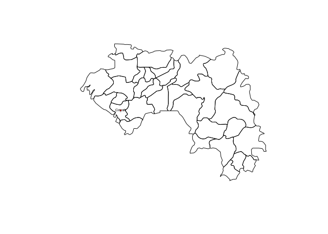
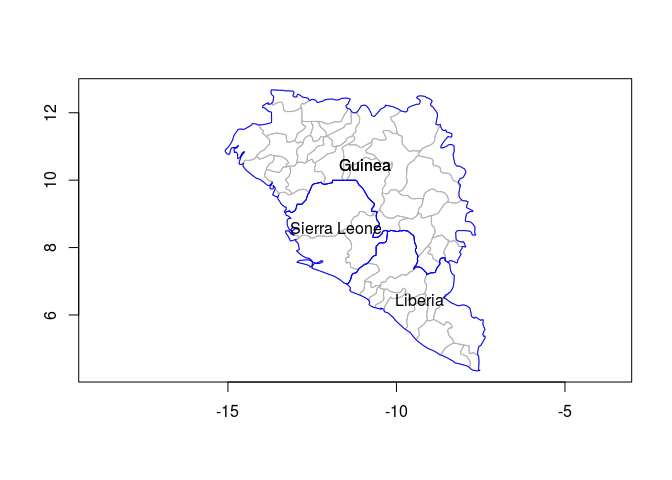

# RCarto
JcB  
05/07/2014  

source [GitHub](https://github.com/jcrb/RCarto)

Application au [London EMS](http://www.londonr.org/Presentations/High%20Quality%20Maps%20With%20R%20-%20Simon%20Hailstone.pptx)

Utilisation de a librairie __ggmap__ pour localiser les hôpitaux. A croiser avec les données du fichier FINESS.

Utilise l'API Google: note that the google maps api limits to 2500 queries a day.


```r
#install.packages("ggmap")
library("ggmap", lib.loc="~/R/x86_64-pc-linux-gnu-library/3.1")
geocode("Nouvel Hôpital Civil")
```

```
    lon   lat
1 7.742 48.58
```

```r
geocode("Hôpital de Hautepierre")
```

```
    lon   lat
1 7.707 48.59
```

```r
adresse <- c("Nouvel Hôpital Civil", "Hôpital de Hautepierre")
loc <- geocode(adresse)
cbind(adresse,loc)
```

```
                 adresse   lon   lat
1   Nouvel Hôpital Civil 7.742 48.58
2 Hôpital de Hautepierre 7.707 48.59
```

```r
adresse <- c("Nouvel Hôpital Civil", "Hôpital de Hautepierre", "Centre hospitalier, Wissembourg", "Clinique sainte Anne, Strasbourg", "Clinique sainte Odile, Strasbourg", "Clinique Diaconat, Strasbourg")
loc <- geocode(adresse)
cbind(adresse,loc)
```

```
                            adresse   lon   lat
1              Nouvel Hôpital Civil 7.742 48.58
2            Hôpital de Hautepierre 7.707 48.59
3   Centre hospitalier, Wissembourg 7.932 49.04
4  Clinique sainte Anne, Strasbourg 7.786 48.62
5 Clinique sainte Odile, Strasbourg 7.757 48.56
6     Clinique Diaconat, Strasbourg 7.743 48.58
```

R et Shapefiles
===============

sources: http://gis.stackexchange.com/questions/19064/how-to-open-a-shapefile-in-r

This will give you an object which is a SpatialPointsDataFrame - the fields of the attribute table are then accessible to you in the same way as an ordinary dataframe, i.e. shape$ID for the ID column.

If you want to use the ASCII file you imported, then you should simply convert the text (character) x and y fields to numbers, e.g.:

shape$x <- as.numeric(shape$x)
shape$y <- as.numeric(shape$y)
coordinates(shape) <- ~x + y

source: http://thebiobucket.blogspot.fr/2011/10/simple-map-example-with-r.html


```r
require(maptools)
```

```
## Loading required package: maptools
## Loading required package: foreign
## Loading required package: sp
## Loading required package: grid
## Loading required package: lattice
## Checking rgeos availability: TRUE
```

```r
path <- "/home/jcb/Documents/NRBCE/EBOLA/cartes/"
guinee.shp <- paste0(path, "GV/gv.shp")
liberia.shp <- paste0(path, "LI/li.shp")
sierra.shp <- paste0(path, "SL/sl.shp")
nigeria.shp <- paste0(path, "NI/ni.shp")
civoire <- paste0(path, "IV/iv.shp")
ghana <- paste0(path, "GH/gh.shp")

shape <- readShapePoly(guinee.shp) # readShapePoints pour un shapefile de points

#structure
str(shape, max.level = 1)
```

```
## Formal class 'SpatialPolygonsDataFrame' [package "sp"] with 5 slots
```

```r
str(shape, max.level = 2)
```

```
## Formal class 'SpatialPolygonsDataFrame' [package "sp"] with 5 slots
##   ..@ data       :'data.frame':	33 obs. of  14 variables:
##   .. ..- attr(*, "data_types")= chr [1:14] "C" "C" "C" "C" ...
##   ..@ polygons   :List of 33
##   ..@ plotOrder  : int [1:33] 30 18 23 13 12 6 16 5 8 26 ...
##   ..@ bbox       : num [1:2, 1:2] -15.08 7.19 -7.65 12.68
##   .. ..- attr(*, "dimnames")=List of 2
##   ..@ proj4string:Formal class 'CRS' [package "sp"] with 1 slots
```

```r
# dessin
plot(shape)
mtext("Guinee-Conacry", 3, line = 0, adj = 0, cex = 2, font = 3)
```

 

```r
# nombrez de slots:
slotNames(shape)
```

```
## [1] "data"        "polygons"    "plotOrder"   "bbox"        "proj4string"
```

```r
# nom des colonnes de l'objet data:
names(shape)
```

```
##  [1] "FIPS_ADMIN" "GMI_ADMIN"  "ADMIN_NAME" "FIPS_CNTRY" "GMI_CNTRY" 
##  [6] "CNTRY_NAME" "REGION"     "CONTINENT"  "POP_ADMIN"  "SQKM_ADMIN"
## [11] "SQMI_ADMIN" "TYPE_ENG"   "TYPE_LOC"   "COLOR_MAP"
```

```r
levels(shape$ADMIN_NAME)
```

```
##  [1] "Beyla"       "Boffa"       "Boke"        "Conakry"     "Coyah"      
##  [6] "Dabola"      "Dalaba"      "Dinguiraye"  "Faranah"     "Forecariah" 
## [11] "Fria"        "Gaoual"      "Gueckedou"   "Kankan"      "Kerouane"   
## [16] "Kindia"      "Kissidougou" "Koubia"      "Koundara"    "Kouroussa"  
## [21] "Labe"        "Lelouma"     "Lola"        "Macenta"     "Mali"       
## [26] "Mamou"       "Mandiana"    "Nzerekore"   "Pita"        "Siguiri"    
## [31] "Telimele"    "Tougue"      "Yomou"
```

```r
# dataframe associé:
# -  FIPS code (Federal Information Processing Standards) FIPS 6-4 pour les pays http://fr.wikipedia.org/wiki/Federal_Information_Processing_Standard

d <- shape@data
names(d)
```

```
##  [1] "FIPS_ADMIN" "GMI_ADMIN"  "ADMIN_NAME" "FIPS_CNTRY" "GMI_CNTRY" 
##  [6] "CNTRY_NAME" "REGION"     "CONTINENT"  "POP_ADMIN"  "SQKM_ADMIN"
## [11] "SQMI_ADMIN" "TYPE_ENG"   "TYPE_LOC"   "COLOR_MAP"
```

```r
levels(shape$ADMIN_NAME)
```

```
##  [1] "Beyla"       "Boffa"       "Boke"        "Conakry"     "Coyah"      
##  [6] "Dabola"      "Dalaba"      "Dinguiraye"  "Faranah"     "Forecariah" 
## [11] "Fria"        "Gaoual"      "Gueckedou"   "Kankan"      "Kerouane"   
## [16] "Kindia"      "Kissidougou" "Koubia"      "Koundara"    "Kouroussa"  
## [21] "Labe"        "Lelouma"     "Lola"        "Macenta"     "Mali"       
## [26] "Mamou"       "Mandiana"    "Nzerekore"   "Pita"        "Siguiri"    
## [31] "Telimele"    "Tougue"      "Yomou"
```

```r
# lecture du slot labptr[[1]]
a <- shape@polygons
c <- a[[1]]@Polygons
c[[1]]@labpt
```

```
## [1] -13.48  10.01
```

```r
c[[1]]@labpt[1]
```

```
## [1] -13.48
```

```r
# ce qui est équivalent:
x <- shape@polygons[[1]]@Polygons[[1]]@labpt

# nom des provinces
plot(shape)
points( x[1], x[2], pch = 16, col = 2, cex = .5)
text(x[1], x[2], d$ADMIN_NAME[1], cex=0.5)
```

 

```r
# on renumérote les polygones pour pouvoir fusionner avec un autre shapefile
shape <- spChFIDs(shape, as.character(d$GMI_ADMIN)) # row.names sont maintenant renumérotées selon GMI_ADMIN
liberia.shp <- "/home/jcb/Documents/NRBCE/EBOLA/cartes/LI/li.shp"

shape2 <- readShapePoly(liberia.shp)
d.lib <- shape2@data
shape2 <- spChFIDs(shape2, as.character(d.lib$GMI_ADMIN))

q <- spRbind(shape, shape2) #spRbind n'accèpte que 2 shapes à la fois
plot(q)
```

 

```r
length(slot(q, "polygons"))
```

```
## [1] 46
```

```r
# on ajoute la sierra-lone
shape3 <- readShapePoly(sierra.shp)
d.sierra <- shape3@data
shape3 <- spChFIDs(shape3, as.character(d.sierra$GMI_ADMIN))
q <- spRbind(q, shape3)
plot(q)
```

 

```r
# enfin le nigéria
# shape4 <- readShapePoly(nigeria.shp)
# d.nigeria <- shape4@data
# shape4 <- spChFIDs(shape4, as.character(d.nigeria$GMI_ADMIN))

# On met les limites des régions en gris, des pays en bleu et on ajoute le nom des pays
# la méthode unionSpatialPolygons permet de fusionner les polygones régionaux
d <- q@data
cntry <- unionSpatialPolygons(q, IDs = d$CNTRY_NAME)
```

```
## Loading required package: rgeos
## rgeos version: 0.3-4, (SVN revision 438)
##  GEOS runtime version: 3.4.2-CAPI-1.8.2 r3921 
##  Polygon checking: TRUE
```

```r
plot(cntry)
```

 

```r
plot(q, border="gray70", axes=T)
plot(cntry, add = TRUE, axes = TRUE, border = "blue")
x <- cntry@polygons[[1]]@labpt[1]
y <- cntry@polygons[[1]]@labpt[2]
pays <- cntry@polygons[[1]]@ID
text(x, y, pays)
for(i in 1:3){x <- cntry@polygons[[i]]@labpt[1]; y <- cntry@polygons[[i]]@labpt[2]; pays <- cntry@polygons[[i]]@ID;  text(x, y, pays)}
```

 

