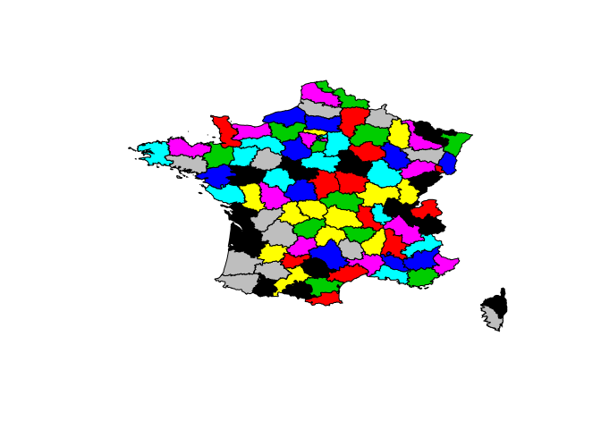

# RCarto
JcB  
05/07/2014  

Les données spatiales sont traitées par de nombreux packages qui sont regroupés [ici](http://cran.r-project.org/web/views/Spatial.html). Ce site est maintenu par Roger Bivand.

Utilisation de gmap
===================

source [GitHub](https://github.com/jcrb/RCarto)

Application au [London EMS](http://www.londonr.org/Presentations/High%20Quality%20Maps%20With%20R%20-%20Simon%20Hailstone.pptx)

Utilisation de a librairie __ggmap__ pour localiser les hôpitaux. A croiser avec les données du fichier FINESS.

Utilise l'API Google: note that the google maps api limits to 2500 queries a day.


```r
#install.packages("ggmap")
library("ggmap")
geocode("Nouvel Hôpital Civil")
```

```
    lon   lat
1 7.742 48.58
```

```r
geocode("Hôpital de Hautepierre")
```

```
    lon   lat
1 7.707 48.59
```

```r
adresse <- c("Nouvel Hôpital Civil", "Hôpital de Hautepierre")
loc <- geocode(adresse)
cbind(adresse,loc)
```

```
                 adresse   lon   lat
1   Nouvel Hôpital Civil 7.742 48.58
2 Hôpital de Hautepierre 7.707 48.59
```

```r
adresse <- c("Nouvel Hôpital Civil", "Hôpital de Hautepierre", "Centre hospitalier, Wissembourg", "Clinique sainte Anne, Strasbourg", "Clinique sainte Odile, Strasbourg", "Clinique Diaconat, Strasbourg")
loc <- geocode(adresse)
cbind(adresse,loc)
```

```
                            adresse   lon   lat
1              Nouvel Hôpital Civil 7.742 48.58
2            Hôpital de Hautepierre 7.707 48.59
3   Centre hospitalier, Wissembourg 7.932 49.04
4  Clinique sainte Anne, Strasbourg 7.786 48.62
5 Clinique sainte Odile, Strasbourg 7.757 48.56
6     Clinique Diaconat, Strasbourg 7.743 48.58
```

```{}
SierraLeone <- c("Kailahun","Kenema","Bombali","Port Loko","Tonkolili","Koinadugu","Freetown","Bonthe","Moyamba","Bo","Pujehun","Kono","Kambia")
d <- geocode(SierraLeone)
v <- cbind(SierraLeone, d)
write.table(v, file="SierraLeone_villes.csv")


  SierraLeone        lon       lat
1     Kailahun  -10.57389  8.277222
2       Kenema  -11.19572  7.863215
3      Bombali  -12.16327  9.247584
4    Port Loko  -12.78750  8.766667
5    Tonkolili  -11.79476  8.980427
6    Koinadugu  -11.36363  9.516877
7     Freetown  -13.23444  8.484444
8       Bonthe  -12.50500  7.526389
9      Moyamba  -12.43333  8.160556
10          Bo   11.25238 44.369331
11     Pujehun  -11.71806  7.350556
12        Kono -117.01361 44.020557
13      Kambia  -12.91765  9.126166

Kailahun        378
Kenema	250
Kono	1
Kambia	1
Bombali	7
Tonkolili	2
Port Loko	22
Pujehun	3
Bo	22
Moyamba	4
Bonthe	1
Freetown	11
Western area Rural	1
Koinadugu	0

```


R et Shapefiles (maptools)
===============

sources: http://gis.stackexchange.com/questions/19064/how-to-open-a-shapefile-in-r

This will give you an object which is a SpatialPointsDataFrame - the fields of the attribute table are then accessible to you in the same way as an ordinary dataframe, i.e. shape$ID for the ID column.

If you want to use the ASCII file you imported, then you should simply convert the text (character) x and y fields to numbers, e.g.:

shape$x <- as.numeric(shape$x)
shape$y <- as.numeric(shape$y)
coordinates(shape) <- ~x + y

source: http://thebiobucket.blogspot.fr/2011/10/simple-map-example-with-r.html

Les fonds de carte (shapefile) sont dans le dossier /home/jcb/Documents/NRBCE/EBOLA/cartes. Ils proviennent du programme __EpiInfo__ sont librement accessibles sur le site du [CDC](http://wwwn.cdc.gov/epiinfo/html/shapefiles.htm)

```r
require(maptools)
```

```
## Loading required package: maptools
## Loading required package: foreign
## Loading required package: sp
## Loading required package: grid
## Loading required package: lattice
## Checking rgeos availability: TRUE
```

```r
path <- "/home/jcb/Documents/NRBCE/EBOLA/cartes/"
guinee.shp <- paste0(path, "GV/gv.shp")
liberia.shp <- paste0(path, "LI/li.shp")
sierra.shp <- paste0(path, "SL/sl.shp")
nigeria.shp <- paste0(path, "NI/ni.shp")
civoire.shp <- paste0(path, "IV/iv.shp")
ghana.shp <- paste0(path, "GH/gh.shp")
togo.shp <- paste0(path, "TO/to.shp")
cameroun.shp <- paste0(path, "cm/cm.shp")
benin.shp <- paste0(path, "bn/bn.shp")

# Bénin
shape.benin <- readShapePoly(benin.shp)
plot(shape.benin)
```

 

```r
# Libéria
shape.liberia <- readShapePoly(liberia.shp)
plot(shape.liberia)
```

 

```r
d.lib <- shape.liberia@data
```
Un pays correspond a un dossier shapefile. Ce dossier contient plusieurs fichiers dont un seul est obligatoire _.shp_. C'est ce fichier qui est lu par les méthodes shapefile de R. Il ya 3 sortes d'objet shapefile: les points, les lignes et les polygones. Les pays sont des polygones pour lesquels on utilise la méthode __readShapePoly(liberia.shp)__ qui stoche les données du dossier dans un objet _"SpatialPolygonsDataFrame"_. Schématiquement l'objet se compose de deux parties:
- un dataframe contenant des informations complémentaires sur l'objet et auquel on peut rajouter des informations
- des éléments cartographiques permettant de dessiner l'objet.

Techniquement l'objet est composé de _slot_. Le _slot data_ contient le dataframe. On y accède par:
```{}
dataframe <- objet@data
```


Libéria avec [DIVA-GIS](http://www.diva-gis.org/datadown). Ce site propose des SF de la plupart des pays avec des niveaux de précision variables. Par exemple, il y a 4 version pour les limites administratives du Libéria:
- niveau 0: contour du pays, 1 ligne dans le DF
- niveau 1: régions, 15 lignes
- niveau 2: districts, 66 lignes
- niveau 3: communes, 305 lignes

Les données sont plus à jour que les fonds de carte fournis par épiinfo.


```r
lib0.shp <- paste0(path, "LBR_adm/LBR_adm0.shp")
shape.lib0 <- readShapePoly(lib0.shp)
plot(shape.lib0)
```

 

```r
d0 <- shape.lib0@data

lib1.shp <- paste0(path, "LBR_adm/LBR_adm1.shp")
shape.lib1 <- readShapePoly(lib1.shp)
plot(shape.lib1)
```

 

```r
d1 <- shape.lib1@data
head(d1)
```

```
##   ID_0 ISO  NAME_0 ID_1      NAME_1 VARNAME_1 NL_NAME_1 HASC_1 CC_1 TYPE_1
## 0  128 LBR Liberia 1630        Lofa      <NA>      <NA>  LR.LF   21 County
## 1  128 LBR Liberia 1631     Margibi      <NA>      <NA>  LR.MG   24 County
## 2  128 LBR Liberia 1632    Maryland      <NA>      <NA>  LR.MY   27 County
## 3  128 LBR Liberia 1633 Montserrado      <NA>      <NA>  LR.MO   30 County
## 4  128 LBR Liberia 1634       Nimba      <NA>      <NA>  LR.NI   33 County
## 5  128 LBR Liberia 1635  River Cess Rivercess      <NA>  LR.RI   36 County
##   ENGTYPE_1 VALIDFR_1 VALIDTO_1 REMARKS_1 Shape_Leng Shape_Area
## 0    County      1963   Present      <NA>      5.599     0.8410
## 1    County      1985   Present      <NA>      3.240     0.2297
## 2    County      1857   Present      <NA>      2.793     0.1787
## 3    County   Unknown   Present      <NA>      2.808     0.1479
## 4    County      1963   Present      <NA>      5.468     0.9733
## 5    County  19550219   Present      <NA>      3.356     0.4316
```

```r
lib2.shp <- paste0(path, "LBR_adm/LBR_adm2.shp")
shape.lib2 <- readShapePoly(lib2.shp)
plot(shape.lib2)
```

 

```r
d2 <- shape.lib2@data
head(d2)
```

```
##   ID_0 ISO  NAME_0 ID_1 NAME_1  ID_2     NAME_2 VARNAME_2 NL_NAME_2 HASC_2
## 0  128 LBR Liberia 1623   Bomi 19594       Klay      <NA>      <NA>   <NA>
## 1  128 LBR Liberia 1623   Bomi 19595      Mecca      <NA>      <NA>   <NA>
## 2  128 LBR Liberia 1624   Bong 19596     Fuamah      <NA>      <NA>   <NA>
## 3  128 LBR Liberia 1624   Bong 19597 Jorquelleh      <NA>      <NA>   <NA>
## 4  128 LBR Liberia 1624   Bong 19598    Kokoyah      <NA>      <NA>   <NA>
## 5  128 LBR Liberia 1624   Bong 19599  Panta-Kpa      <NA>      <NA>   <NA>
##   CC_2   TYPE_2 ENGTYPE_2 VALIDFR_2 VALIDTO_2 REMARKS_2 Shape_Leng
## 0   02 District  District   Unknown   Unknown      <NA>     1.9974
## 1   04 District  District   Unknown   Unknown      <NA>     0.7886
## 2   02 District  District   Unknown   Unknown      <NA>     1.2600
## 3   04 District  District   Unknown   Unknown      <NA>     1.6613
## 4   06 District  District   Unknown   Unknown      <NA>     1.6006
## 5   08 District  District   Unknown   Unknown      <NA>     1.6867
##   Shape_Area
## 0    0.15091
## 1    0.02150
## 2    0.08642
## 3    0.10626
## 4    0.07548
## 5    0.08069
```

```r
lib3.shp <- paste0(path, "LBR_adm/LBR_adm3.shp")
shape.lib3 <- readShapePoly(lib3.shp)
plot(shape.lib3)
```

 

```r
d3 <- shape.lib3@data
head(d3)
```

```
##   ID_0 ISO  NAME_0 ID_1 NAME_1  ID_2 NAME_2  ID_3  NAME_3 VARNAME_3
## 0  128 LBR Liberia 1623   Bomi 19594   Klay 38020 Blugban      <NA>
## 1  128 LBR Liberia 1623   Bomi 19594   Klay 38021 Dey-Gbo      <NA>
## 2  128 LBR Liberia 1623   Bomi 19594   Klay 38022 Gbarvon      <NA>
## 3  128 LBR Liberia 1623   Bomi 19594   Klay 38023  Gbojey      <NA>
## 4  128 LBR Liberia 1623   Bomi 19594   Klay 38024    Gbor      <NA>
## 5  128 LBR Liberia 1623   Bomi 19594   Klay 38025 Gorblah      <NA>
##   NL_NAME_3 HASC_3 TYPE_3 ENGTYPE_3 VALIDFR_3 VALIDTO_3 REMARKS_3
## 0      <NA>   <NA>   Clan      Clan   Unknown   Present      <NA>
## 1      <NA>   <NA>   Clan      Clan   Unknown   Present      <NA>
## 2      <NA>   <NA>   Clan      Clan   Unknown   Present      <NA>
## 3      <NA>   <NA>   Clan      Clan   Unknown   Present      <NA>
## 4      <NA>   <NA>   Clan      Clan   Unknown   Present      <NA>
## 5      <NA>   <NA>   Clan      Clan   Unknown   Present      <NA>
##   Shape_Leng Shape_Area
## 0     0.7525   0.021624
## 1     0.4745   0.005761
## 2     0.3463   0.005924
## 3     0.3532   0.005865
## 4     0.6636   0.012898
## 5     0.3978   0.009238
```


```r
shape <- readShapePoly(guinee.shp) # readShapePoints pour un shapefile de points

#structure
str(shape, max.level = 1)
```

```
## Formal class 'SpatialPolygonsDataFrame' [package "sp"] with 5 slots
```

```r
str(shape, max.level = 2)
```

```
## Formal class 'SpatialPolygonsDataFrame' [package "sp"] with 5 slots
##   ..@ data       :'data.frame':	33 obs. of  14 variables:
##   .. ..- attr(*, "data_types")= chr [1:14] "C" "C" "C" "C" ...
##   ..@ polygons   :List of 33
##   ..@ plotOrder  : int [1:33] 30 18 23 13 12 6 16 5 8 26 ...
##   ..@ bbox       : num [1:2, 1:2] -15.08 7.19 -7.65 12.68
##   .. ..- attr(*, "dimnames")=List of 2
##   ..@ proj4string:Formal class 'CRS' [package "sp"] with 1 slots
```

```r
# dessin
plot(shape)
mtext("Guinee-Conacry", 3, line = 0, adj = 0, cex = 2, font = 3)
```

 

```r
# nombrez de slots:
slotNames(shape)
```

```
## [1] "data"        "polygons"    "plotOrder"   "bbox"        "proj4string"
```

```r
# nom des colonnes de l'objet data:
names(shape)
```

```
##  [1] "FIPS_ADMIN" "GMI_ADMIN"  "ADMIN_NAME" "FIPS_CNTRY" "GMI_CNTRY" 
##  [6] "CNTRY_NAME" "REGION"     "CONTINENT"  "POP_ADMIN"  "SQKM_ADMIN"
## [11] "SQMI_ADMIN" "TYPE_ENG"   "TYPE_LOC"   "COLOR_MAP"
```

```r
levels(shape$ADMIN_NAME)
```

```
##  [1] "Beyla"       "Boffa"       "Boke"        "Conakry"     "Coyah"      
##  [6] "Dabola"      "Dalaba"      "Dinguiraye"  "Faranah"     "Forecariah" 
## [11] "Fria"        "Gaoual"      "Gueckedou"   "Kankan"      "Kerouane"   
## [16] "Kindia"      "Kissidougou" "Koubia"      "Koundara"    "Kouroussa"  
## [21] "Labe"        "Lelouma"     "Lola"        "Macenta"     "Mali"       
## [26] "Mamou"       "Mandiana"    "Nzerekore"   "Pita"        "Siguiri"    
## [31] "Telimele"    "Tougue"      "Yomou"
```

```r
# dataframe associé:
# -  FIPS code (Federal Information Processing Standards) FIPS 6-4 pour les pays http://fr.wikipedia.org/wiki/Federal_Information_Processing_Standard

d <- shape@data
names(d)
```

```
##  [1] "FIPS_ADMIN" "GMI_ADMIN"  "ADMIN_NAME" "FIPS_CNTRY" "GMI_CNTRY" 
##  [6] "CNTRY_NAME" "REGION"     "CONTINENT"  "POP_ADMIN"  "SQKM_ADMIN"
## [11] "SQMI_ADMIN" "TYPE_ENG"   "TYPE_LOC"   "COLOR_MAP"
```

```r
levels(shape$ADMIN_NAME)
```

```
##  [1] "Beyla"       "Boffa"       "Boke"        "Conakry"     "Coyah"      
##  [6] "Dabola"      "Dalaba"      "Dinguiraye"  "Faranah"     "Forecariah" 
## [11] "Fria"        "Gaoual"      "Gueckedou"   "Kankan"      "Kerouane"   
## [16] "Kindia"      "Kissidougou" "Koubia"      "Koundara"    "Kouroussa"  
## [21] "Labe"        "Lelouma"     "Lola"        "Macenta"     "Mali"       
## [26] "Mamou"       "Mandiana"    "Nzerekore"   "Pita"        "Siguiri"    
## [31] "Telimele"    "Tougue"      "Yomou"
```

```r
# lecture du slot labptr[[1]]
a <- shape@polygons
c <- a[[1]]@Polygons
c[[1]]@labpt
```

```
## [1] -13.48  10.01
```

```r
c[[1]]@labpt[1]
```

```
## [1] -13.48
```

```r
# ce qui est équivalent:
x <- shape@polygons[[1]]@Polygons[[1]]@labpt

# nom des provinces
plot(shape)
points( x[1], x[2], pch = 16, col = 2, cex = .5)
text(x[1], x[2], d$ADMIN_NAME[1], cex=0.5)
```

 

```r
# on renumérote les polygones pour pouvoir fusionner avec un autre shapefile
shape <- spChFIDs(shape, as.character(d$GMI_ADMIN)) # row.names sont maintenant renumérotées selon GMI_ADMIN
liberia.shp <- "/home/jcb/Documents/NRBCE/EBOLA/cartes/LI/li.shp"

shape2 <- readShapePoly(liberia.shp)
d.lib <- shape2@data
shape2 <- spChFIDs(shape2, as.character(d.lib$GMI_ADMIN))

q <- spRbind(shape, shape2) #spRbind n'accèpte que 2 shapes à la fois
plot(q)
```

 

```r
length(slot(q, "polygons"))
```

```
## [1] 46
```

```r
# on ajoute la sierra-lone
shape3 <- readShapePoly(sierra.shp)
d.sierra <- shape3@data
shape3 <- spChFIDs(shape3, as.character(d.sierra$GMI_ADMIN))
q <- spRbind(q, shape3)
plot(q)
```

 

```r
# enfin le nigéria
# shape4 <- readShapePoly(nigeria.shp)
# d.nigeria <- shape4@data
# shape4 <- spChFIDs(shape4, as.character(d.nigeria$GMI_ADMIN))

# On met les limites des régions en gris, des pays en bleu et on ajoute le nom des pays
# la méthode unionSpatialPolygons permet de fusionner les polygones régionaux
d <- q@data
cntry <- unionSpatialPolygons(q, IDs = d$CNTRY_NAME)
```

```
## Loading required package: rgeos
## rgeos version: 0.3-4, (SVN revision 438)
##  GEOS runtime version: 3.4.2-CAPI-1.8.2 r3921 
##  Polygon checking: TRUE
```

```r
plot(cntry)
```

 

```r
plot(q, border="gray70", axes=T)
plot(cntry, add = TRUE, axes = TRUE, border = "blue")
x <- cntry@polygons[[1]]@labpt[1]
y <- cntry@polygons[[1]]@labpt[2]
pays <- cntry@polygons[[1]]@ID
text(x, y, pays)
for(i in 1:3){x <- cntry@polygons[[i]]@labpt[1]; y <- cntry@polygons[[i]]@labpt[2]; pays <- cntry@polygons[[i]]@ID;  text(x, y, pays)}
```

 

Carte de la Sierre Leone
------------------------


```r
file <- "SierraLeone_villes.csv"
villes.sl <- read.table(file)
cas <- c(378,250,7,22,2,NA,12,1,4,22,3,1,1) # nb de cas au 12/8/2014
villes.sl <- cbind(villes.sl, cas)

shape.sierra <- readShapePoly(sierra.shp)
plot(shape.sierra)
symbols(villes.sl[,2], villes.sl[,3], circles=villes.sl[,4], bg="yellow", add=TRUE)
points(villes.sl[,2], villes.sl[,3], pch=16, col=2, cex=0.8)
text(villes.sl[,2], villes.sl[,3], villes.sl[,1], pos=1)
text(villes.sl[,2], villes.sl[,3], villes.sl[,4], pos=3, col="blue")
mtext("Sierra Leone le 12/08/2014", 3, line = 0, adj = 0, cex = 2, font = 3)
```

 

Le site [GADM](http://www.gadm.org/)
====================================

Propose des shapefile de tous les pays du monde directement pour __R__.

Application pour la France. Le fichier une fois dézippé contient 5 shapefiles et 5 fichiers .csv correspondants au dataframe associés:
- FRA_adm0.shp contour de la France
- FRA_adm1.shp limites régionales
- FRA_adm2.shp départemets
- FRA_adm3.shp  (y compris Paris)
- FRA_adm4.shp cantons
- FRA_adm0.shp communes


```r
require(maptools)
path <- "/home/jcb/Documents/NRBCE/EBOLA/cartes/"
france.dep <- paste0(path, "FRA_adm/FRA_adm2.shp")
shape.fr.dep <- readShapePoly(france.dep)
plot
```

```
## standardGeneric for "plot" defined from package "graphics"
## 
## function (x, y, ...) 
## standardGeneric("plot")
## <environment: 0x2974b80>
## Methods may be defined for arguments: x, y
## Use  showMethods("plot")  for currently available ones.
```

```r
dep <- shape.fr.dep@data

plot(shape.fr.dep, col=dep$ID_2)
```

 

